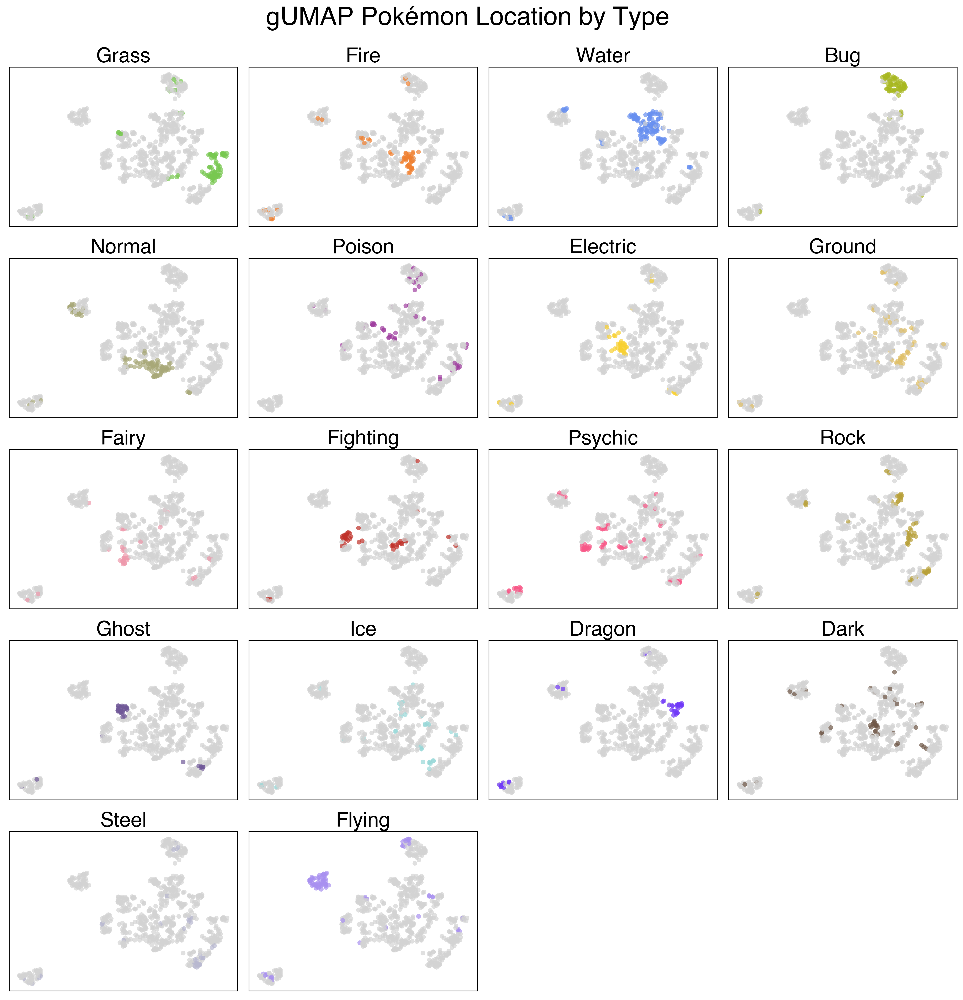
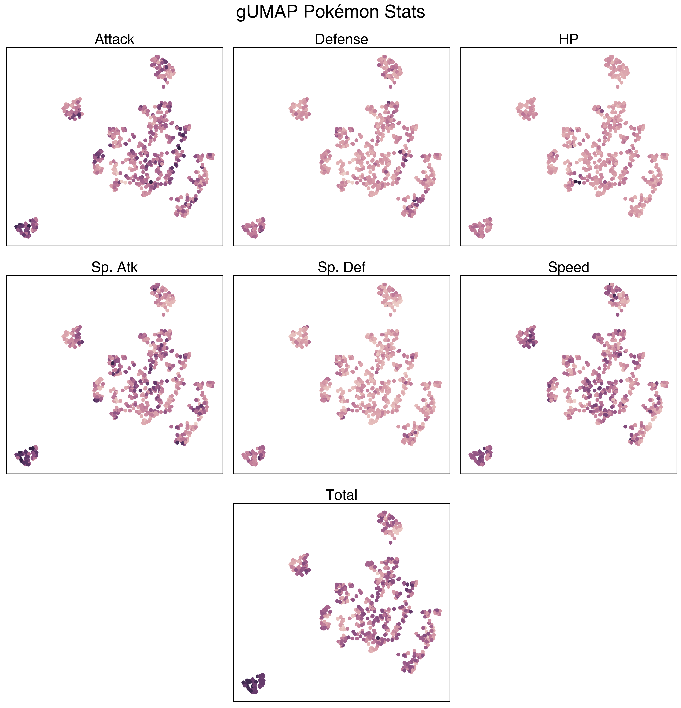
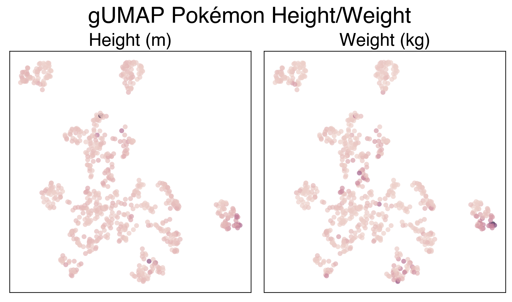
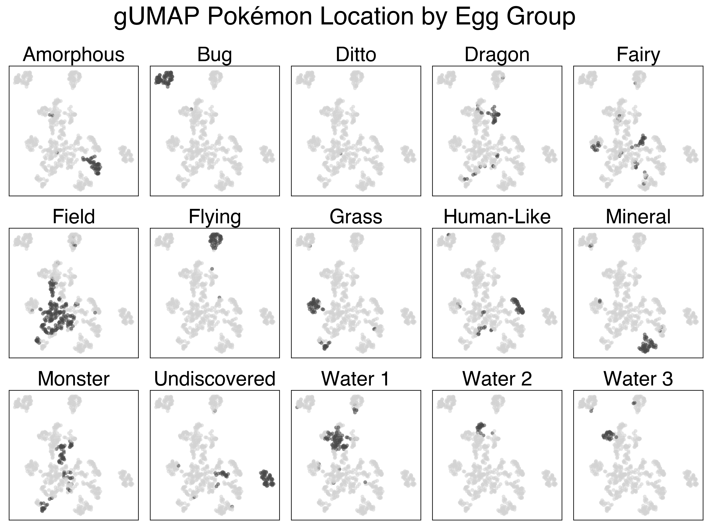
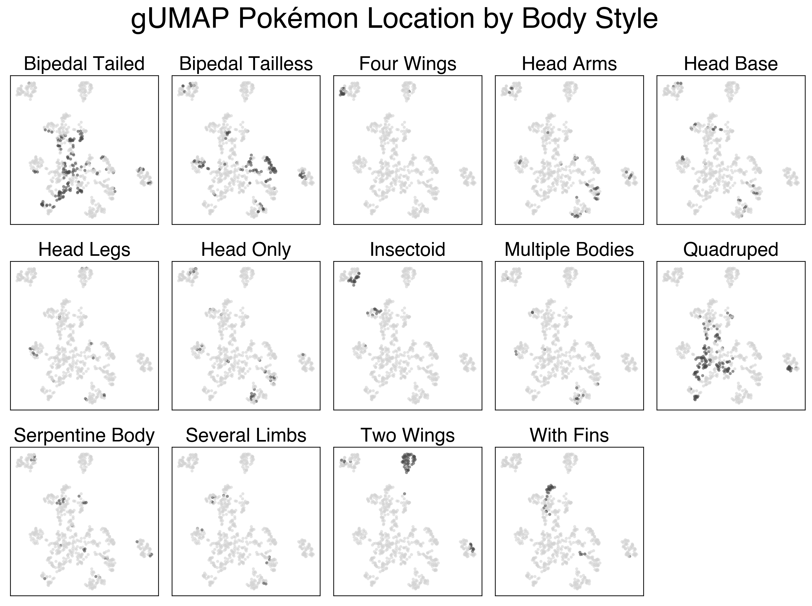

We used this dataset because we thought it would be illustrative of how integrating both categorical and numeric data could be useful. To show this, we first ran UMAP on only the numeric features in the dataset: `Attack, Defense, Sp. Atk, Sp. Def, Height, Weight, BST, Catch_Rate`. `Pr_Male` was dropped from this run as it was not present for all Pokemon. Next, we ran UMAP using only the categorical variables (using Gower distance): `Type 1/2, isLegendary, Color, hasGender, Egg Group1/2, hasMegaEvolution, Body Style`. Finally, we used all variables (including `Pr_Male`, as the Gower distance computation deals with it) and plotted the resultant distance matrix through UMAP.

<iframe src="../html/pokemon_only_num.html"
    sandbox="allow-same-origin allow-scripts"
    width="100%"
    height="500"
    scrolling="no"
    seamless="seamless"
    frameborder="0">
</iframe>

We see that this plot is not very helpful. There are a couple distinguishable clusters: mainly of "weak" early-stage Pokemon vs. more mid-stage and final-stage Pokemon. We can also sort of see a tail of high BST legendary Pokemon. But overall, this plot is not very good at clustering the Pokemon.

<iframe src="../html/pokemon_only_cat.html"
    sandbox="allow-same-origin allow-scripts"
    width="100%"
    height="500"
    scrolling="no"
    seamless="seamless"
    frameborder="0">
</iframe>

This plot performs a lot better, but it still has its flaws. We see a clear separation of Flying type and Bug type Pokemon, as well as some of the more humanoid Pokemon. The clusters still aren't very interesting though. There's also some funny local structure here: like how the baby Pokemon are so close to the legendaries (seeing as neither group can breed). This demonstrates one of the pitfalls of categorical clustering on this dataset - a lot of what makes Pokemon unique (their stats) is absent.

<iframe src="../html/pokemon_gower.html"
    sandbox="allow-same-origin allow-scripts"
    width="100%"
    height="500"
    scrolling="no"
    seamless="seamless"
    frameborder="0">
</iframe>

The UMAP projection using the full feature set is a lot more interesting. There's a clear cluster of legendary Pokemon, as well as clusters of Flying and Bug pokemon that we saw previously. Looking at the large mass with the rest of the Pokemon, we can sort of make out some patterns. The plants generally colocalize, as do the fish, amorphous forms, and more traditional animal Pokemon.

Below are a series of plots of this projection annotated by their features. I wanted to add this functionality to the Bokeh plot, but that would require me to know/learn JavaScript.

[Back to home](../index.md)
